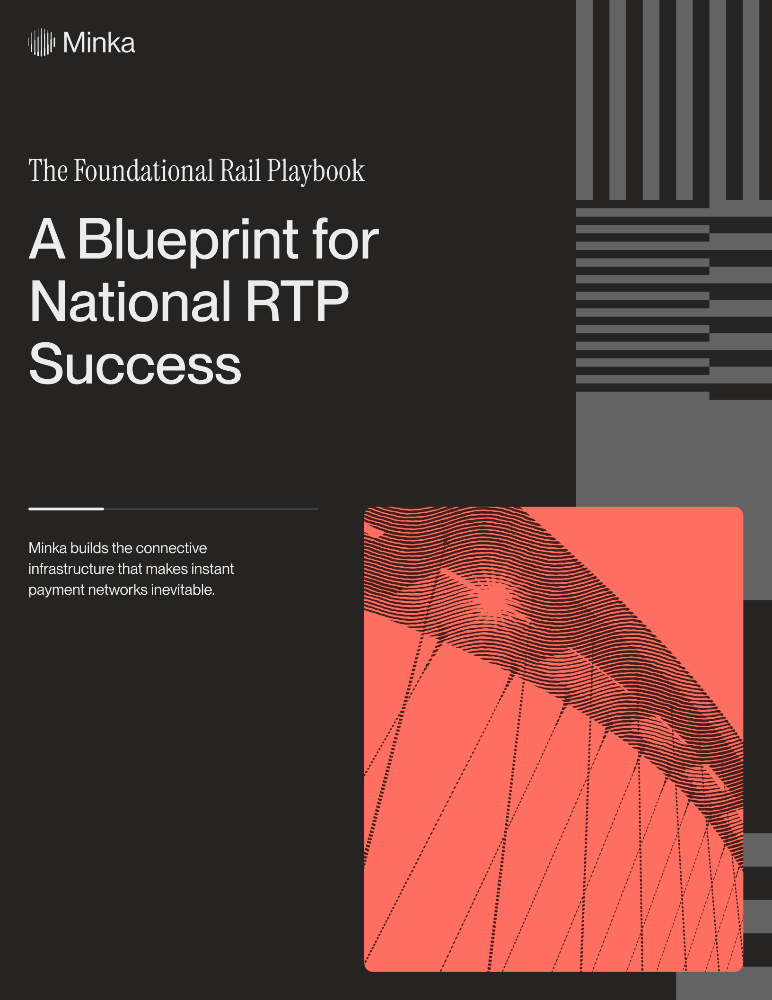
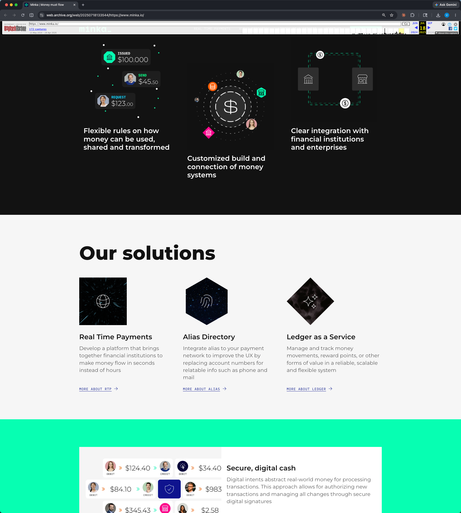
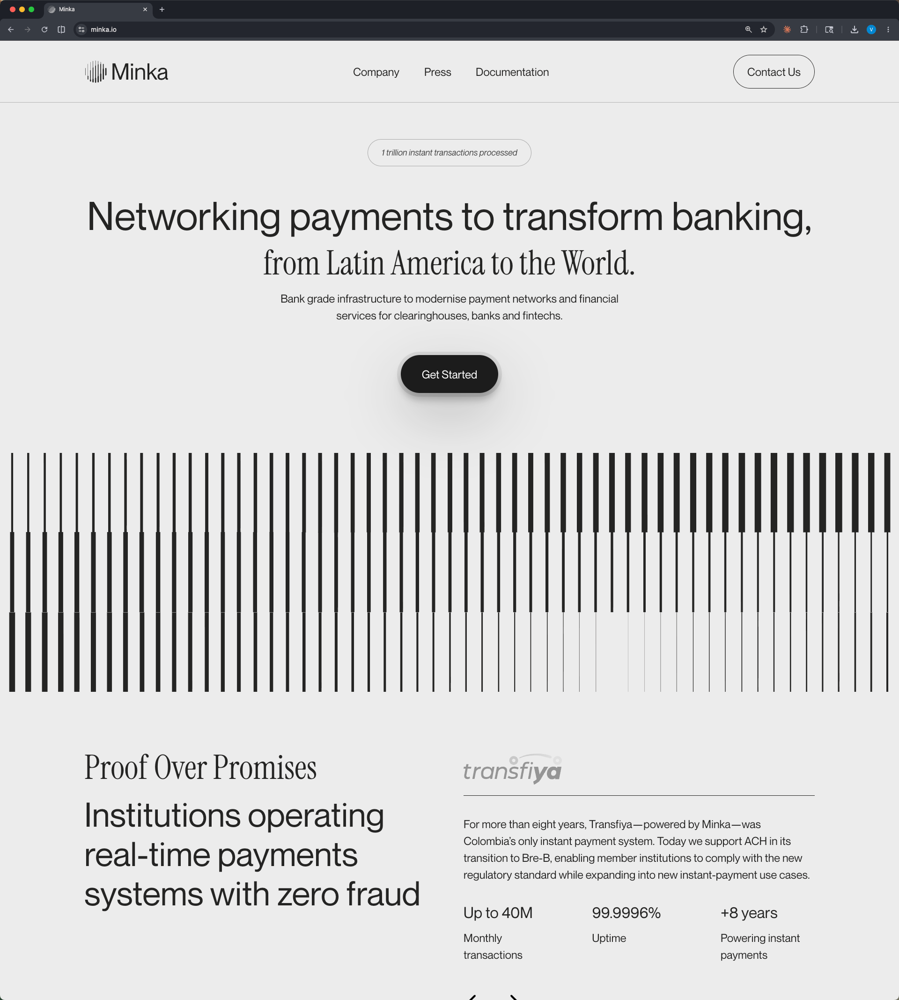
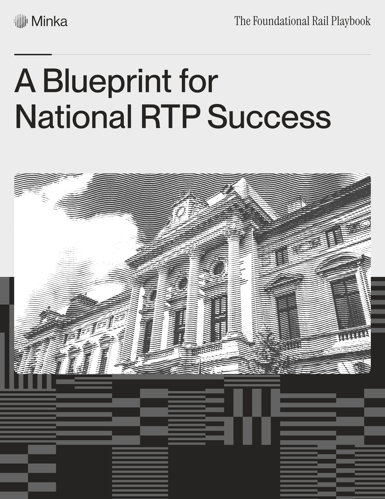
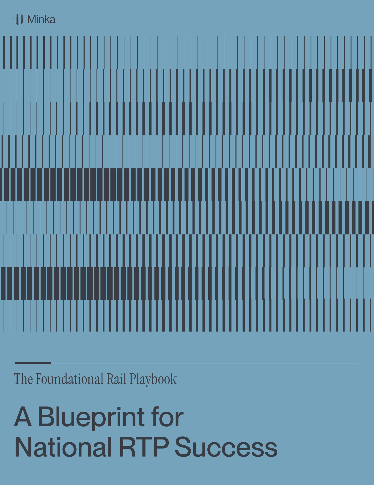
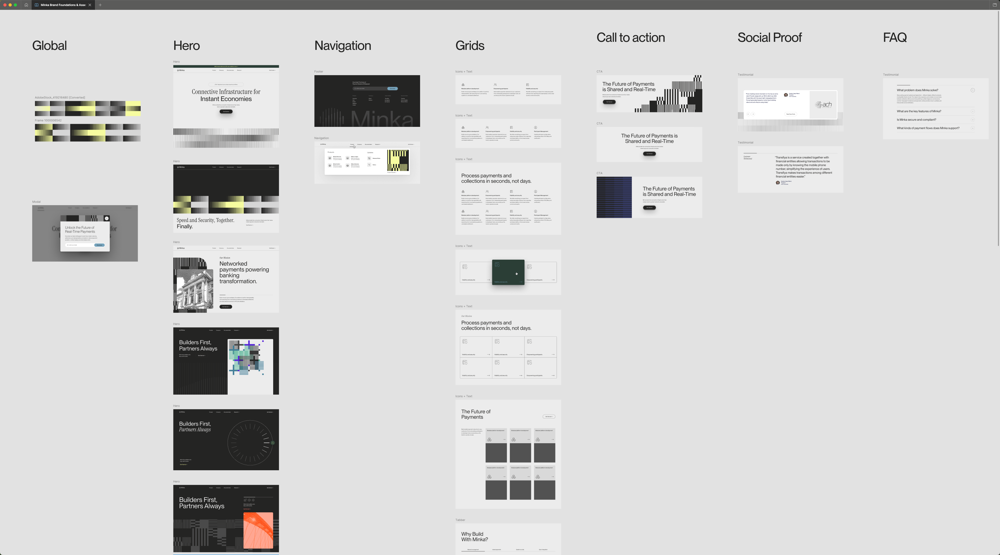
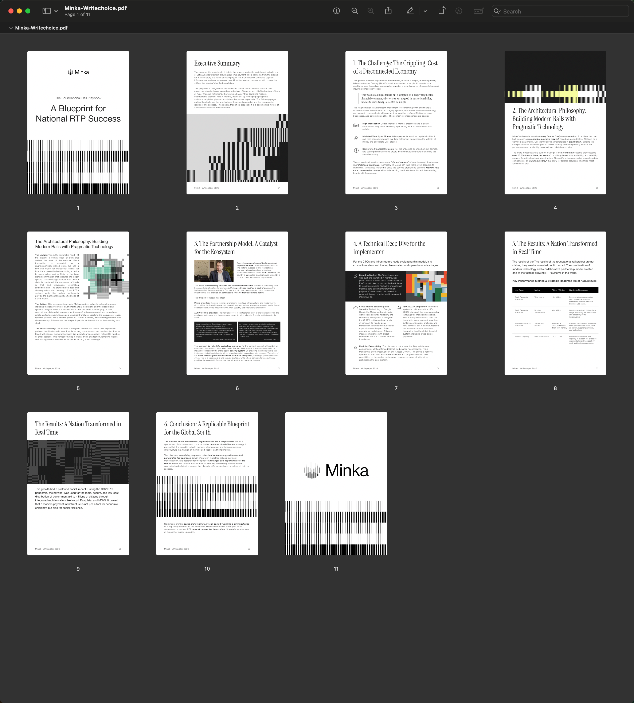

theme: rojos-us
autoscale: true
footer: Minka  Portfolio Case Study
build-lists: true
slide-transition: fade(0.3)

# [fit] Minka Branding

## Repositioning enterprise payment infrastructure from blockchain heritage to institutional trust

**GTM Lead · 2024 to 2026**

A company-wide strategic shift, sequenced as repositioning , sales messaging, visual identity and GTM rollout. The rebrand resolved a real sales-engineering and buyer-solution coordination crisis at the root.

^ This case study is about strategic product marketing in B2B fintech, with visual identity as one of three load-bearing outputs. Minka deploys payment networks and integration hubs for national clearinghouses and banks. I led a company-wide repositioning from the company's earlier blockchain-startup identity to institutional-trust enterprise infrastructure. The headline output is the new visual identity, but the load-bearing work was clarifying who Minka serves and what Minka sells  and then operationalizing that clarity across sales, engineering, and the market. The visual identity is the most visible piece. The strategic clarification is the spine.

---

## The triggering moment was a sales-engineering and buyer-solution coordination crisis

Sales drove deals outside any defined ICP and product. Every deck and deal appeared custom. Engineering struggled to understand sales focus. There was an underlying confusion about our market and product requiring alignment on who Minka sold to and what Minka sold.

The rebrand was an outcome of strategic clarification of audience and offering, expressed through messaging, scoping, pricing and visual identity.

^ Most rebrand case studies start with "the brand felt outdated." This one didn't. The triggering moment was an internal friction crisis. Sales was pushing every potentially closable deal because no qualification framework said otherwise. Every deck was custom. Every price was custom. And engineering was being asked to deliver against deals whose technical requirements didn't match what Minka actually built  and they were right to push back, because building bespoke for poorly-qualified buyers is how infrastructure companies die. The friction wasn't a stakeholder disagreement. It was structural. And what looked like a market-positioning problem on the outside was actually an internal-clarity problem first. Nobody had forced alignment on who Minka served and what Minka sold. The rebrand became the forcing function.

---

## Our positioning was an abstract ledger service leading to a fragmented brand and sales experience, overly focused on technology

The previous identity was built iteratively over a crypto-startup heritage:

- Abstract space theme signaling "frontier technology"
- Fragmented brand presence across surfaces
- Documentation and GTM materials focused on abstract platform vision, not ICP pains
- Sales conversations stalled because Minka was being pitched as a *payments dev shop*

That framing ran counter to scaling a Series A enterprise infrastructure vendor. Dev-shop framing implies project work, hourly billing, customization on customer terms that complicates deal closing.

^ Quick orientation on the before. The previous identity had a deep blockchain-startup heritage  abstract space theme, fragmented brand presence, documentation and GTM materials that described the abstract platform rather than the buyer's pain. The cumulative effect was that sales conversations frequently positioned Minka as a custom payments dev shop. That's a catastrophic miscommunication for an enterprise infrastructure company. Dev-shop framing implies project work, hourly billing, customization on customer terms  the exact opposite of what an institutional infrastructure vendor relationship looks like. The visual identity wasn't just stale. It was anti-aligned with the buyer Minka actually needed to reach.

---

## The audience defines every brand decision, boards and executives at clearinghouses and banks.

**Two institutional segments**

- **Clearinghouses** buying **RTP Switch**
- **Banks** buying **Integration Hubs**

**Board and executive inside those institutions**

The most senior, risk-averse, time-poor decision-makers in financial services.

- Don't recognize innovation-led visual languages as trustworthy
- Don't read abstract platform descriptions but solutions mapped to layers of the financial infrastructure stack
- Expect technical claims to be verifiable by their own evaluators

^ The narrowed ICP was two segments  clearinghouses buying RTP Switch and banks buying Integration Hubs. That's a clean two-by-two: each product mapped to each buyer type. And within those institutions, the buyer is specifically board and executive level. That distinction matters because it defines the register the whole rebrand had to hit. Board-and-executive buyers in financial services don't recognize developer-led visual languages as trustworthy. They don't read abstract platform descriptions; they read solutions mapped to layers of the financial infrastructure stack. They expect technical claims to be authenticatable by their own evaluators. Every choice downstream of this  messaging register, visual reference points, channel selection  flows from understanding exactly who the buyer is. Get the audience wrong, get everything wrong.

---

[.column]
## Sequenced correctly, messaging first and visual identity last

[.graph: #1a1a1a, #4a5568, #ffffff, dark-mode(true)]

```mermaid
%%{init: {'theme':'base', 'themeVariables': { 'fontFamily': 'Azeret Mono, monospace', 'fontSize': '13px' }}}%%

flowchart LR
  A[Repositioning:<br/>Company-wide mapping, competitor analysis] --> B[Messaging Architecture:<br/>3 layers, system outline, ICP definitions] --Strategy-->
  C[Sales Scoping:<br/>deal flow method, reusable pitch, qualification criteria] --> D[Messaging Architecture:<br/>product naming, unique value proposition, jobs to be done framing] --Operational--> E[Visual Identity:<br/>Logomark, design tokens, web components, social media templates] --> F[GTM Rollout:<br/>Framer site, conference materials, sales decks, ads]
```

**Why the sequence matters**: Repositioning produces the messaging architecture and ICP definitions Those become the input for sales efforts like qualification, deal flow, and reusable pitches. Sales scoping closes the loop on what products are sold to whom. *Then* visual identity expresses the now-stable positioning. GTM materials operationalize the identity across the buyer-facing surface.

^ Most rebrands invert the correct sequence  they start with visual identity and scramble to write messaging that fits the new visual. We did it in the right order. Messaging first, sales scoping next, visual identity last. The repositioning thread ran internally. I ran a company-wide mapping exercise, then a competitor analysis, then handed both to the agency in person. The agency synthesized and proposed positioning; I reworked their document iteratively. The reason for keeping the strategic input work internal was deliberate  generic strategy consultants don't know payments infrastructure, and the new positioning had to be technically defensible at the CTO-authentication level. Output was a three-layer messaging architecture and crisp definitions of the two products. The messaging thread became operational  a deal flow method, a reusable pitch that replaced every-deck-is-custom, qualification criteria for deal review. And we reorganized pipeline into two tracks running on mixed efforts. That last decision was crucial because it preserved near-term revenue from startup deals while protecting the core ICP focus. You can't tell sales to drop near-term revenue; you have to give them a way to keep working off-ICP deals without contaminating the strategic focus.

---

## Three-layer messaging architecture mapped to the financial infrastructure stack

- **Top-line mission messaging**  the company-wide one-liner
- **Domain-specific positioning**  mapped to layer-specific needs at clearinghouses and banks
- **System outline**  Minka's solutions partitioned across layers of the financial infrastructure stack

That third layer is the most domain-specific and the artifact the CTO authenticated. Technical buyers don't ask "what do you do?"  they ask "where do you sit in the stack and how do your solutions compose?" The architecture answers that.

^ The messaging architecture had three layers, not two. Top-line mission messaging  the company-wide one-liner. Domain-specific positioning, mapped to layer-specific needs. And  this is the most important layer  a full system outline partitioning Minka's solutions across different layers of the financial infrastructure stack. That third layer is the one technical buyers actually read. They don't ask "what do you do?"  they ask "where do you sit in the stack, how does your solution compose with everything else?" The system outline answers that. It's also the artifact the CTO authenticated, which mattered because the new positioning had to be technically defensible. Generic enterprise-fintech messaging wouldn't survive the first technical evaluation. Layered messaging that maps to the stack does.

---

## Maturing blockchain into institutional trust

Distributed-ledger architecture is a *real* technical differentiator, and board-level buyers at clearinghouses and banks are increasingly comfortable with it as a credential.

The **visual direction** pulled from Modern Treasury's classical institutional register. Decisively away from developer-led dark-mode aesthetics. Often the buyer is *not* the technical evaluator.

^ This is the single most sophisticated move in the rebrand and worth slowing down on. Most rebrands either lean into the heritage or run from it. We threaded a needle. Distributed-ledger architecture is a real technical differentiator for Minka, and board-level buyers at clearinghouses and banks are increasingly comfortable with blockchain as a credential  they're not pattern-matching to crypto anymore. So full disownment would have given up a real claim. But the cultural register had to shift. The hacker-culture, frontier-technology, abstract-space-theme costume had to come off. The compromise we landed on was blockchain-as-mature-middle. Retain the technical claim. Lose the cultural costume. For visual direction, the closest reference was Modern Treasury  classical institutional register, decisively away from developer-led dark-mode aesthetics. Most fintech infrastructure companies default to developer-tools visual languages, but the institutional banking buyer isn't the technical evaluator. The visual identity has to look like what the buyer trusts, not what makes designers' Twitter happy.

---

## Agency-built primitives, internally implemented across GTM surface

**Agency provides:** Logomark, typography, web components, asset templates

**We implement (me + brand designer + design engineer):** A framer-built website, event materials, sales decks, one-pagers, RFP responses, paid ad creatives

The agency budget was tight by necessity. The response was scope discipline: agency builds the primitives that need agency craft. Everything else gets operationalized internally.

^ The agency budget was tight, so the scope of agency-built deliverables had to be the load-bearing primitives  logomark, typography, web components, social media templates. Four things. The rest was operationalized internally. I built the Framer site hands-on. A second designer kept pace on production. A design engineer shared frontend implementation. ELOCC booth and event materials, sales decks, one-pagers, RFP responses, paid ad creative across channels  all internal. ELOCC, by the way, is the Latin American clearinghouse operations summit. Not Sibos. Not Money 20/20. The right small event where the ICP actually shows up, prioritized over the flashier global conferences. That's a Staff-level operating call  going to the right small event beats going to the wrong big one. The pattern in the agency relationship is the same pattern as the engineering thesis from my Wondo project: compose what needs outside expertise, own the implementation that matters. Calibrated trust on both ends. Knowing where to extend creative latitude and where to hold firm.

---

## Customers signaled willingness to do business  the institutional credibility marker

- Unqualified deals reduced; stopped muddying the product team's roadmap
- Pipeline reorganized into high-impact and startup tracks running on mixed efforts
- Distributed sales materials signaled Minka was a serious contender
- Framework has continued to operate within the company beyond the project itself

**Customer signal:** willingness to do business. The most valuable institutional credibility marker available in B2B enterprise sales.

**Where it stayed hard**: Enforcing messaging discipline under sales quota pressure  structural, doesn't go away.

^ Closing on outcomes. Over time, unqualified deals reduced and stopped muddying the product team's roadmap. Pipeline reorganized into high-impact and startup tracks running on mixed efforts  preserving near-term revenue while protecting the strategic focus. Distributed sales materials left a strong impression that Minka was a serious contender. And the most important customer signal  willingness to do business. That phrase matters. Customers don't say "your branding is nice." They signal "you look ready to do business with us." That's the institutional credibility marker. The framework has continued to operate within the company beyond the project itself  operational outputs stuck rather than drifting back to custom. Where it stayed hard: enforcing messaging discipline under quota pressure is structural and never fully goes away. Same with resisting product scope creep in hopes of an imaginary larger market. The framework didn't eliminate those temptations. It made the conversation possible.

---

## Internal clarity comes before external positioning  and post-PMF, Series A is the right window

[.column]

**The operating thesis**

The leverage in repositioning work is *internal alignment*.

External positioning is downstream of how a company sees itself, talks about itself, and qualifies its own pipeline.

Once internal clarity is in place, market-facing work gets dramatically easier. And the rebrand becomes a forcing function on product scope rather than a marketing exercise.

[.column]

**The category-timing lesson**

Near product-market fit, post-Series A is the right window to commit to brand development.

Earlier wastes investment on positioning that's still moving. Later compounds the cost of strategic ambiguity.

**Get it done properly and move forward.**

**What I'd do differently:** reduce agency scope further and move quicker on the brand deployment. The leverage moves wanted to be earlier.

^ Closing on what I'd carry into a next role. Two operating lessons. The first one is about repositioning work generally. The leverage is in internal alignment. External positioning is downstream of how a company sees itself, talks about itself, and qualifies its own pipeline. Once internal clarity is in place, the market-facing work  messaging, visual identity, sales conversations  gets dramatically easier. And the rebrand becomes a forcing function on product scope rather than a marketing exercise. That reframes what rebrand work actually is. The second lesson is about timing. Near product-market fit, post-Series A is the right window to commit to brand development. Earlier wastes investment on positioning that's still moving. Later compounds the cost of strategic ambiguity. Get it done properly and move forward. What I'd do differently if I were running this again is reduce agency scope further and move quicker on the brand deployment. The leverage moves wanted to be earlier. Same instinct I had on the Wondo project  speed and focus are not separate values; they're the same value applied at different layers. That's the operating thesis I'd bring to any Staff role.

