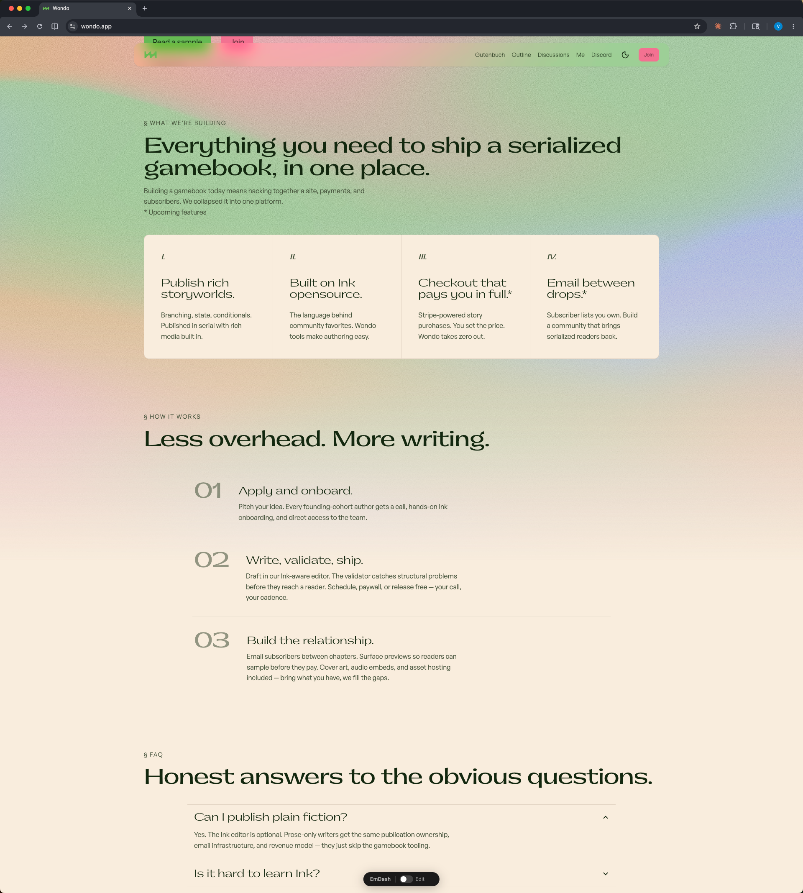
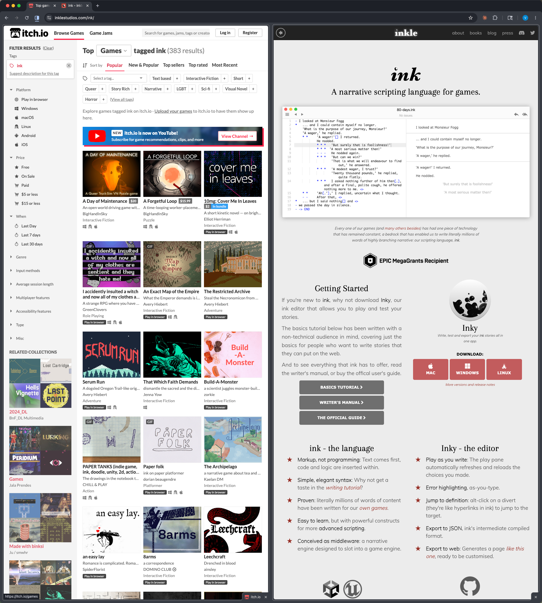
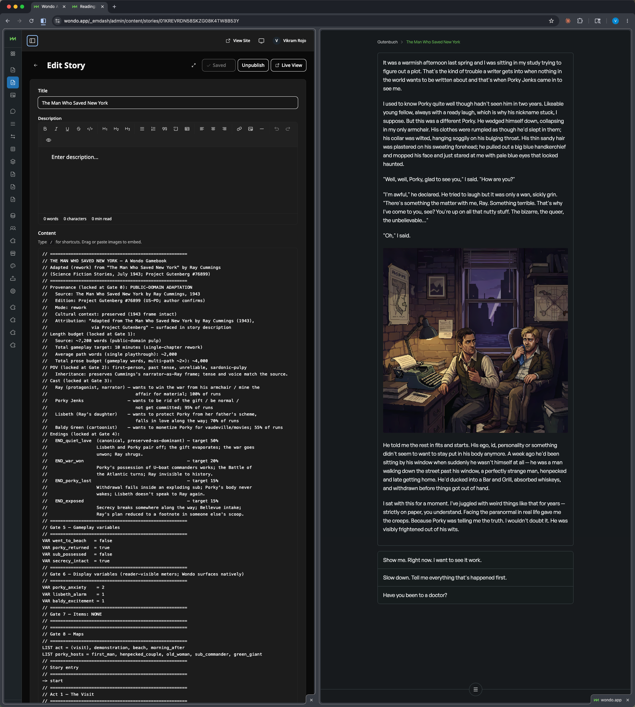
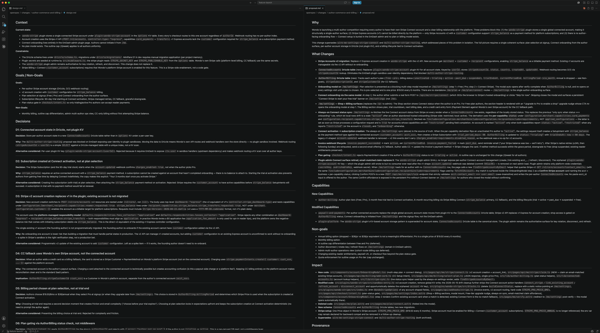
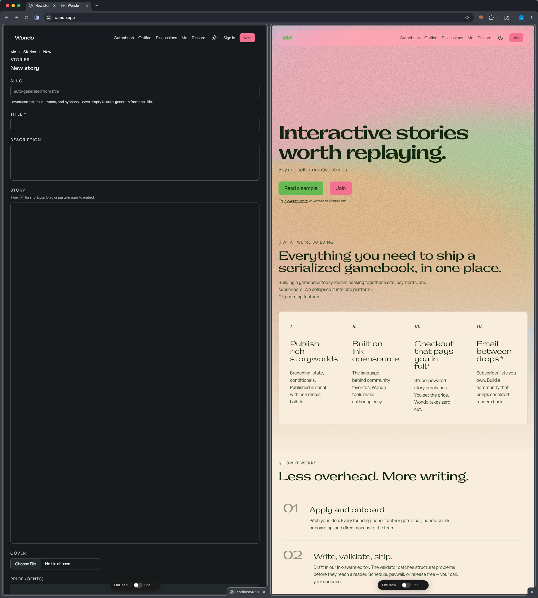

theme: rojos-us
autoscale: true
footer: Wondo Case Study
build-lists: true
slide-transition: fade(0.3)

# [fit] Wondo

## Building a creator-economy platform for interactive fiction as a solo founder-designer-developer

**Designer and Developer · 2026**

This case study is about *agentic methods*: how research, prototyping, and engineering run as three parallel threads when one person owns all three, and what the resulting product reveals about a way of working.

^ This case study is structured differently from a typical portfolio piece because Wondo is structured differently. I'm the founder, sole designer, and sole developer. The product is in beta, launching publicly in summer 2026. The case study isn't about a shipped feature or a redesigned surface. It's about a method  how I work across discovery, design, and engineering at once, and how those three tracks reinforce each other when the same person holds all of them. The product is the evidence; the practice is the spine.

---

## Interactive fiction sits in a structural gap where solutions force authors into game development instead of game design

Wondo is an indie publishing platform and marketplace for interactive fiction with rich media, game state, and branching narrative.

The market sits between two larger worlds: serial-fiction readers on Wattpad, Royal Road, Manta and indie game stores like itch.io and Steam. Neither serves IF natively.

Today's authors face a choice: build their own game engine, or distribute through stores that treat IF as a niche game category. Either way, efforts goes into infrastructure and distribution instead of game narrative design.

^ Let me start by orienting on what Wondo is and what gap it's filling. Interactive fiction  IF  is gamebook-style narrative with branching, variables, and rich media. Think of it as the bridge between a Wattpad-style serial novel and a small narrative game. Today, most IF authors face a hard choice. Either they build their own game engine from scratch  common in the IF community where ChoiceScript and Twine are the standards  or they target a game store like itch.io that treats their work as a niche game and provides no audience native to the form. Either way, they're spending real time on infrastructure instead of writing. And the reader side is fragmented too. The IF-native communities are small. Much larger reader communities exist  Wattpad readers, webnovel readers  but they're not served by IF platforms today. That's the gap.

---

## IF consists of a niche audience but there are adjacent serialized fiction reading communities

The supply-side observation comes from research:

- **r/interactivefiction**  small, devoted, IF-native
- **r/gamebooks**  heritage CYOA audience, distinct from IF-native
- **r/wattpad and adjacent serial-fiction communities**  large, hungry for accessible interactive content but not served
- **itch.io** published ratio of 7 developers to 1 player across indie games

**Wondo's strategy:** lower development and distribution tax authors pay and pitch IF to adjacent reader communities by being mobile first.

^ Here's the strategic call that anchors the whole project. The conventional move in any two-sided marketplace is to ask "which side first?"  and most people in indie creative platforms guess "readers first, supply will follow." The data argues against that. itch.io itself publishes a ratio of 7 developers to 1 player across indie games. That's not a Wondo-specific anomaly  it's a structural feature of indie creative ecosystems. The IF subreddits confirm it: r/interactivefiction has a small, devoted audience; r/gamebooks is heritage Choose-Your-Own-Adventure; the larger reader communities for serial fiction are on platforms like Wattpad that don't serve IF at all. So the wedge isn't building a better reader experience and hoping authors show up. The wedge is empowering the supply side  lowering the engine and distribution work that currently sits on authors  and letting the resulting work reach adjacent reader communities natively, especially on mobile.

---

## Solo founder, three roles, drawing on prior community-scaling experience

[.column]

**My role**

Founder, designer, and developer  solo.

Research, design, prototyping, spec-writing, and engineering all owned end-to-end.

Prior experience scaling a community through a web magazine. The audience-engagement work on Wondo is drawing on a playbook I've used before, applied to a different category.

[.column]

**Out of scope (deliberately)**

Advanced game mechanics  audio narration, animation, dice systems  are on the roadmap but not in beta.

Production complexity in those areas would raise the bar for authors at the exact moment Wondo is trying to lower it. Mobile reading benefits from text-first until the platform finds its footing.

^ I'm solo. There's no design partner, no engineering team, no PM. I own research, design, prototyping, spec-writing, and engineering end to end. Worth flagging because the case study is partly about what that role-shape actually enables. Solo doesn't mean naive  I've previously run a web magazine and have prior experience scaling a community. The audience-engagement work on Wondo, including the author competition I'll talk about in a few slides, isn't a first attempt at audience building. It's a playbook I've used before, applied to a different category. And there's intentional out-of-scope: advanced game mechanics like audio narration, animation, dice  those are real opportunities, but I'm deliberately deferring them. The reason is the same as everything else on this project: I'm trying to lower the bar for authors, not raise it. Production complexity comes after the platform finds its footing.

---

## Five intentional constraints that for rapid engineering

**Emdash CMS as an AI harness**  skip building data model, editing, roles, auth. Acts as a guardrail: if a feature can be descoped to fit Emdash, it usually is.

**Ink as the runtime**  Inkle's open-source IF language. Authors arriving from other tools transfer immediately; existing community come for free.

**AstroJS on Cloudflare edge**  popular stack for light content sites. Adding an API layer makes it a SaaS/site hybrid.

**Tailwind, minimal brand**  design system layer handled. The brand is deliberately quiet so it doesn't compete with the content.

**Stripe Connect for author-owned commerce**  authors own their stores and their relationship with readers. Wondo isn't a marketplace that sits in the middle.

^ This is the spine of the engineering thread, and arguably of the whole project. Five constraints that look like five separate stack choices, but actually compound into one coherent philosophy: build less in this layer, so I can build more in the layers that matter. Emdash CMS handles the platform primitives  data model, editing, roles, auth, commenting, accounts. It's also acting as a guardrail. The default move on any new feature isn't "what do I need to build?" It's "what can I descope to fit Emdash?" Ink is the open-source IF runtime from Inkle, the studio behind Heaven's Vault and 80 Days. Adopting it instead of inventing a Wondo-specific language means authors arriving from Twine or ChoiceScript can transfer their thinking immediately. JavaScript-minimal on Cloudflare edge is the popular stack for light products  adding an API layer turns it into a SaaS/site hybrid. Tailwind with a deliberately restrained brand keeps the platform from competing with the content. And Stripe Connect makes the author-owned-store model structurally true, not just rhetorical. The important thing isn't that the stack is novel  it's a recognized pattern. The move is recognizing that the same stack works for a creator-economy IF platform in a category where everyone else builds standalone game engines.

---

## Spec-driven development as design artifact, engineering contract, and discipline

Prototyping on Wondo doesn't look like Figma comps that get translated to engineering:

- **Write a spec** that captures research and design intent
- **Validate the spec against core jobs**  before any code
- **Phased build** so engineering proceeds with design gates

The spec is the design artifact *and* the engineering contract.

**Spec Driven Development** collapses design and engineering into one document that captures background, sketches and tracks tasks and changes.

^ The prototyping thread looks different on Wondo than on a team project, and I want to be specific about how. I don't make Figma comps and then translate them to engineering. I write specs. A spec captures the design intent, gets validated against the core user need before code, then engineering proceeds in phases with checkpoints against the spec at each phase. The spec is both the design artifact and the engineering contract. As a solo founder-designer-developer, separating those into different artifacts creates rework I can't afford. The spec collapses them. It also forces a discipline  anything that can be descoped to fit Emdash usually is, and the spec is where that descope happens, before any code. This is closer to how senior IC engineers work without a designer partner than to how designer-prototyping is usually taught. For the Staff Product Engineer audience specifically, this is the slide I'd want to slow down on.

---

## Everything works in beta  and the hardest engineering problems were where third-party composition is fragile

**What's working today, end to end:**

- Authors can sign up, publish IF written in Ink, configure their own stores via Stripe Connect, and reach readers on mobile
- Readers can browse, read, tip, and subscribe
- I've dogfooded the platform by adapting public-domain Gutenberg short SF into playable IF with branching choices and pixel animations  real polished titles, not promo mocks
- Current work is improving user experience and implement a go-to-market plan

^ Beta is fully functional. Authors can sign up, publish their interactive fiction written in Ink, set up their own store via Stripe Connect, and reach readers on mobile. Readers can browse, read, tip subscribers, and follow authors. I've also dogfooded the platform myself by adapting public-domain Gutenberg short science fiction into playable IF  branching choices, pixel animations, the works. That's important because it proves the stack delivers real polished titles, not just promo mocks. It also means the platform isn't waiting on the competition to have something to read; adjacent audiences can be reached now. Most of what I'm working on right now is tweaking. The structural pieces are in place. The hardest engineering problems on the project were sign-in and checkout. That's worth naming because these are the surfaces where third-party composition is fragile. They have to feel seamless across providers  across Stripe, across the auth provider, across Emdash, across edge sessions  and any visible seam ruins the experience. Getting all three of Stripe Connect, auth, and checkout to behave like one coherent surface as a solo founder without a backend team  that's the engineering work I'd be most willing to defend in a technical interview.