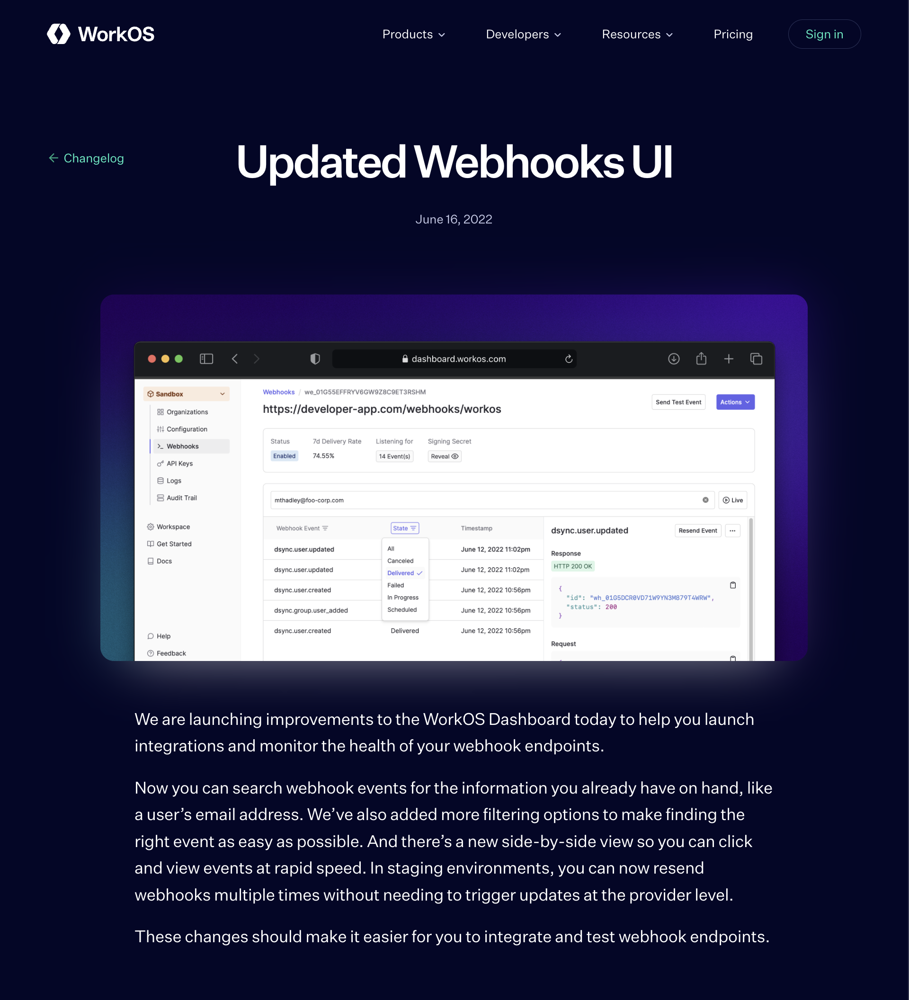
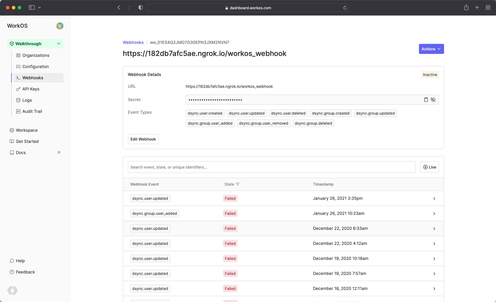
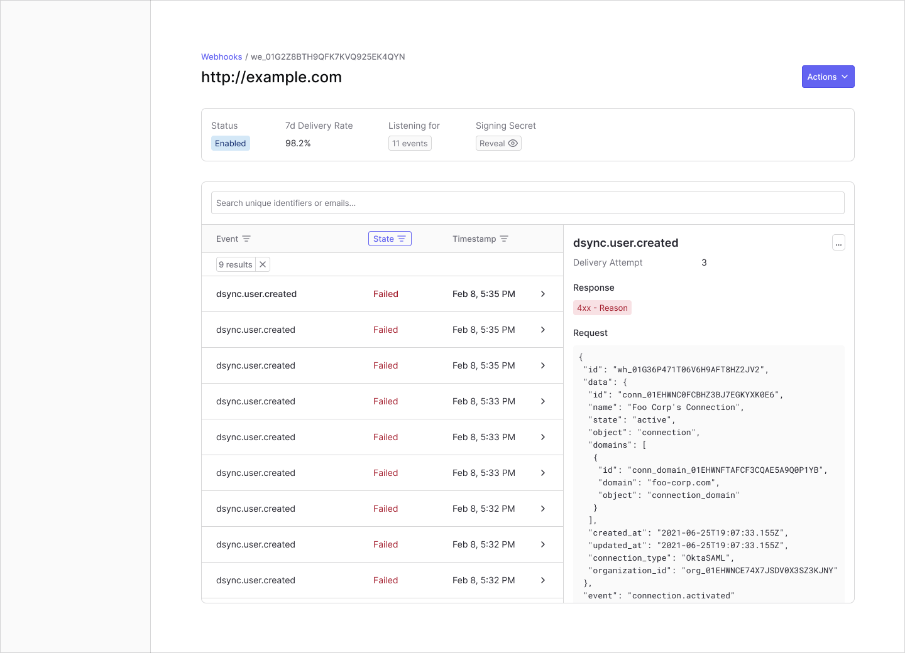
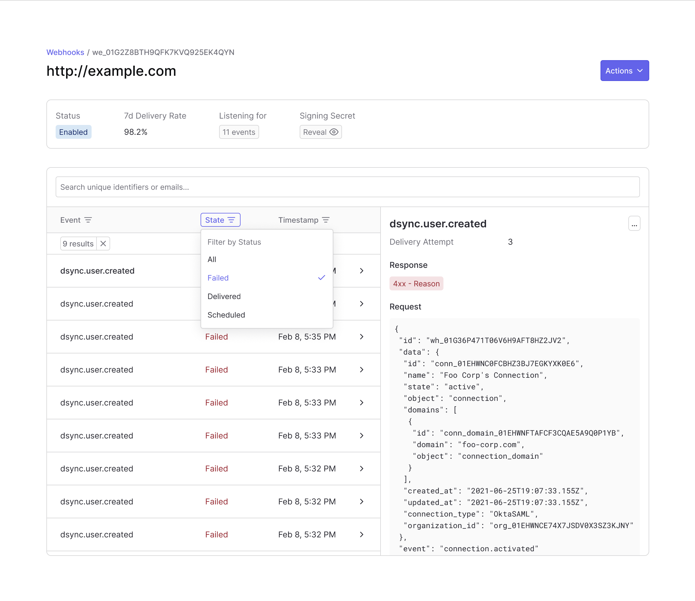
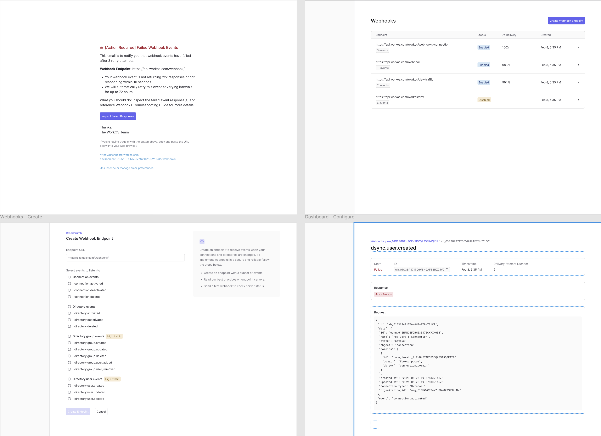

theme: rojo-us
autoscale: true
footer: WorkOS Case Study
build-lists: false
slide-transition: fade(0.3)

# [fit] WorkOS Webhooks

## Redesigning the integration and debugging experience

**Product Designer · Early 2022**

A redesigned dashboard turned a flat event list into a real integration-testing tool and introduced a column-inspection pattern to the design system.

^ This is the project I want to walk you through — the WorkOS webhooks dashboard redesign. WorkOS is developer infrastructure for enterprise authentication, and webhooks are how the platform pushes real-time updates to customer applications. I led design end-to-end on this. It shipped in June 2022. The reason I'm leading with this project is that it's a clean example of how I work at the intersection of developer experience, design-system thinking, and scope discipline — and one of the outcomes is a pattern that's still in use across the WorkOS dashboard.

---

## Webhooks are how WorkOS pushes real-time updates. When they break, the provider's dashboard is the only debugging window

[.column]

**WorkOS sells developer infrastructure** for enterprise auth — SSO, directory sync, user management.

**Webhooks are the inverse of REST** — instead of customer apps polling for updates, WorkOS pushes events when something changes.

[.column]

**The advantage:** real-time reaction without polling overhead.

**The cost:** when something goes wrong, customers can't debug locally — they have to use whatever surface the provider gives them.

*Pull (REST) vs. push (webhooks). When webhooks break, only the provider's dashboard can tell you what happened.*

^ Quick framing for anyone not deep in developer-tools: webhooks are essentially the inverse of a REST API. Instead of an app constantly polling — "any updates? any updates?" — WorkOS pushes a notification the moment something changes. It's better for real-time reactivity. But it has one structural cost: when something goes wrong, the debugging surface lives in *our* dashboard, not in the customer's logs. So if WorkOS's webhooks UI is bad, customers are stuck. They can see *that* something failed, but not always *why*. That structural reality is what made this project a primary product surface, not a side project.

---

## Developers couldn't find broken events — and testing handlers required recreating upstream state every time

Three independent signals were pointing at the same problem:

- **Customer Support tickets** — developers couldn't locate the relevant event when a customer reported an issue by email or user ID
- **Dogfood friction** — internal devs hit the same wall during integration; recreating upstream state to test was tiresome and produced false negatives
- **Integration funnel** — time-to-first-successful-webhook was longer than it should have been

The pre-redesign dashboard surfaced a flat event list and high-level connection status. That was it.

^ The reason this project earned investment was that three independent signals were all pointing at the same problem. Customer Support kept escalating tickets where developers couldn't find a specific event — usually because all they had was a customer's email and there was no way to search by it. Internal devs hit the same wall, but from a different angle — they were trying to test their webhook handlers, and the only way to do that was to keep recreating the upstream state that produced an event. That's slow, and it's also unreliable — if the test failed, you couldn't tell whether your code was broken or your test setup was. And then the integration funnel itself was showing longer-than-expected time-to-first-successful-webhook. When three independent signals all point at the same problem, that's the moment to invest. That's what made this a primary product surface rather than a nice-to-have.

---

# Sole designer on a team of four — partnering directly with Customer Support for discovery

[.column]

**My role**

- Design end-to-end: discovery, prototyping, UX copy, production-ready assets
- Led discovery by partnering with Customer Support
- Pushed for the column-inspection pattern against the design-system default

[.column]

**The team**

- **PM** — Stephen Haney (stakeholder alignment, engineering scoping)
- **Engineering** — David Liu, Vitor Capretz
- **Research partner** — Customer Support (no dedicated researcher on the project)

^ I was the sole designer. I partnered with our PM Stephen Haney, who handled stakeholder alignment and engineering scoping — which freed me to spend my time on the design problem rather than coordination. Two engineers, David Liu and Vitor Capretz, built it. Worth being explicit about one thing: discovery was design-led, not research-led. There was no dedicated researcher on the project. I partnered directly with Customer Support to source the qualitative signal, and that turned out to be the right move — CS was sitting on the highest-fidelity record of where developers actually got stuck, way more useful than running a formal study would have been.

---

## Customer Support surfaced the key insight

Discovery had three parts:

1. **Surface-area inventory** — every place webhook information appeared: dashboard, error emails, transactional emails, error states, docs, the creation flow
2. **Pattern research** — established webhook debugging interfaces (Stripe, Svix, others in dev-tools)
3. **JTBD with Customer Support** — actual jobs developers were trying to do

**The key finding: resend.** Developers were repeatedly recreating upstream states to debug integration. The friction was visible in support tickets — but not in pattern research.

^ Discovery had three parts and they were ordered deliberately. Surface-area inventory came first because the dashboard view was only part of the story — the debugging experience extended into emails, error responses, docs, and the creation flow itself. Pattern research came next so I'd be making informed pattern decisions rather than inventing in a vacuum. JTBD work with CS came last because by then I had enough product context to ask the right questions. And the killer finding came from CS, not from pattern research. Pattern research tells you what other products do; CS tells you what your customers actually struggle with. The two are different and the second is more valuable. The resend feature — which became one of the most important parts of what shipped — was a CS contribution. They were sitting on it.

---

## "Easier to develop" lost to a JTBD argument backed by precedent

The dashboard's default detail pattern was a **drawer modal**. Cheap to build, well-supported.

I pushed for **column inspection** instead — persistent list, persistent inspector, click-through without losing context.

**Why it mattered:** Debugging webhooks is high-volume scanning, not single-event reading. Drawers add a navigation tax on every click. At the scale of events discovery surfaced, that tax was prohibitive.

**How the argument was won:** JTBD signal (volume of inspections) + pattern precedent from adjacent dev tools (Stripe, Svix). Engineering agreed to the more expensive path.

**The durable outcome:** The frontend team later codified column-inspection into the design system. The pattern outlived the feature.

^ This is the decision I'd point to as the spine of this project. The dashboard's default detail-view pattern was drawer modals. They're cheap to build and well-supported by the design system — engineering's natural preference. I pushed back. Debugging webhooks isn't a single-event activity, it's high-volume scanning: scan the list, click an event, read, click the next, compare, click again. Drawer modals add a navigation tax on every click — open, read, close, scan, open, read, close. At the scale of events discovery had surfaced, that tax was prohibitive. The way I won the argument wasn't by arguing back on cost — it was by showing the cheaper option failed the actual job, with evidence from JTBD work and pattern precedent from adjacent dev tools. The team agreed to the more expensive path. And the durable outcome, which I think is the most important thing on this slide: the frontend team later codified column-inspection into the design system, and it propagated to other list-and-detail surfaces. The feature shipped. The pattern stayed.

---

## Search, filters, inspector, and resend — designed as one connected system

Each capability narrowed the developer's path to the event they needed:

- **Search by user data** — scoped to email, ID, event state and type. CS's "find by who" need anchored the scope; I resisted overbuilding into a generic search engine.
- **Filters by webhook type and state** — composed with search. Search narrows *who*, filters narrow *what kind*.
- **Side-by-side inspection** — the column pattern, with state persisting across clicks for fast comparison.
- **Manual resend in staging** — closing the integration-testing loop without auto-retrying behind the developer.

^ The four capabilities shipped together as a system, not as independent features. Each one narrowed the developer's path to the event they were looking for. Search anchored on the CS finding — developers had emails and IDs, that's what they needed to search by. I scoped it deliberately to those known-useful fields rather than building a generic search engine. Filters composed with search — search narrows by who, filters by what kind and what state. The inspector was the column pattern in production. And then resend — I want to flag the scope call on resend specifically because it's a decision I'd happily defend in any interview. Resend originally surfaced as auto-resend in staging, which was the cheapest implementation. I pulled it back to manual resend on demand. The reason: auto-retry in staging would have made the testing loop ambiguous. When an event re-fired, the developer couldn't tell whether the re-fire was their test or the system's automatic retry. Manual resend gave them deliberate control. And the production guardrail is surfaced in product copy — "to prevent you from potentially muddying your production data." That decision is visible in the UI, not buried in design rationale.

---

## Discovery extended beyond the dashboard — endpoint creation, error emails, best-practices docs

*The surfaces a developer actually touches during integration. The dashboard wasn't the integration experience — it was the most visible piece.*

**Endpoint creation flow**

- Highlighted high-traffic events so customers could prepare
- Enabled multiple events at once
- Linked to a best-practices guide for handling, security, and testing

**Error notification emails**

- Restructured around making retry behavior visible
- "Right information at the right time" — is this retry ongoing, exhausted, or successful?

^ The surface-area inventory paid off here. Shipping a clean dashboard view while leaving inconsistent error emails or outdated copy would have undercut the work. The endpoint creation flow was rebuilt to highlight high-traffic events so customers could prepare for them, to enable multiple events at once, and to link directly to a best-practices guide on event handling and endpoint security. Error notification emails were restructured around making retry behavior visible — WorkOS retries failed deliveries multiple times, and the previous emails didn't give developers a clear picture of that retry state. The redesign focused on the right information at the right time. This step also required collaborating with engineering to map what already existed in the legacy surfaces — the system was mid-refactor, and the existing copy wasn't all clearly documented. Discovery continued into handoff out of necessity, and the shipped product was cohesive across surfaces as a result. Discovery isn't a phase, it's a discipline.

---

## Support volume dropped, integration time improved — and the pattern outlived the feature

[.column]

**What changed**

- Support ticket volume on webhook-related issues dropped
- Time-to-first-successful-webhook improved
- Updated documentation, linked from the creation flow, compounded the onboarding effect

Directional signals, not quantified — but consistent across CS, the integration funnel, and customer feedback.

**The durable outcome:** the column-inspection pattern entered the design system and propagated to other dashboard surfaces.

[.column]

**What I'd do differently**

Push for a larger scope sooner. The resend feature surfaced late from JTBD work and was added under time pressure with scope reduced. The integration-testing workflow deserved to be front-loaded.

**What this taught me**

For developer infrastructure, the integration and debugging experience is a primary surface of the product — not a quality-of-life concern. It either elevates the product over competitors or stands as a barrier to customer success.

**Debugging is the product.**

^ A few things on outcomes. The signals were directional rather than quantified — I don't have exact figures, and I'd rather be honest about that than invent numbers. But they pointed consistently in the same direction across multiple feedback channels: CS, the integration funnel, customer feedback. Support volume on webhooks specifically dropped. Time-to-first-successful-webhook improved. Documentation shipped in parallel and was linked directly from the creation flow, which compounded the effect. The most durable outcome is the pattern in the design system. The feature shipped, the pattern stayed. What I'd do differently: push for a larger scope sooner. The resend feature surfaced late from JTBD work and was added under time pressure. In retrospect the integration-testing workflow deserved to be front-loaded in the scope conversation rather than discovered as we went. Next time I'd advocate harder upfront for explicit testing-loop affordances, even before discovery confirmed the need. And the bigger lesson, which is really how I think about developer-tools design now: for a developer infrastructure company, debugging is not a quality-of-life concern. It's a primary surface of the product. It either elevates the product over competitors or it stands as a barrier between customers and success. Treating it as a first-class design problem — with the same rigor as the marketing site or the onboarding flow — pays off disproportionately. Because it shapes whether customers ever reach the value of the underlying infrastructure at all.
